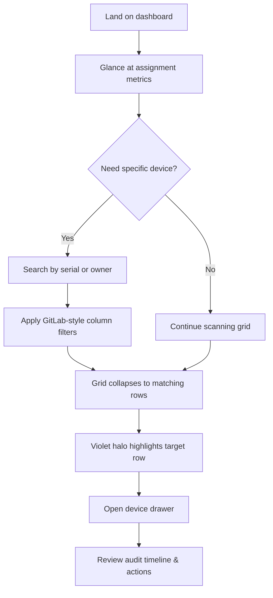
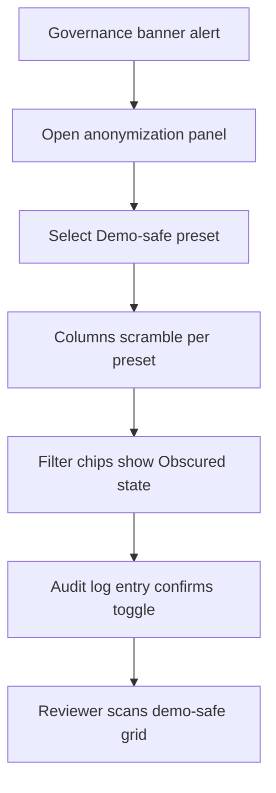
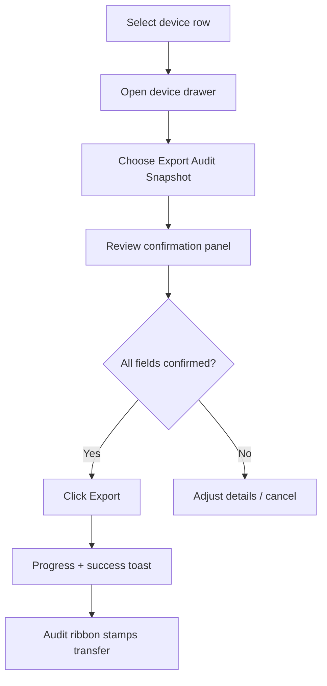

# BMAD Demo NodeJS Project UX Design Specification

_Created on 2025-11-04 by Aditya_
_Generated using BMad Method - Create UX Design Workflow v1.0_

---

## Executive Summary

The BMAD Demo NodeJS Project reimagines the admissions device roster as a responsive internal web app. It ingests the Google Sheet into MongoDB, wraps it in a premium, low-latency interface, and gives managers instant confidence in hardware assignments during demos by keeping the data live and governance-ready.

---

## 1. Design System Foundation

### 1.1 Design System Choice

We’ll build on **shadcn/ui** components (v0.8.1) composed with **Radix UI primitives** (v2.0.1), giving us accessible, production-ready behavior out of the box while keeping the visual layer lightweight enough to express NYU’s governance cues. This stack delivers enterprise-grade data tables, dialogs, and stateful banners without locking us into a heavy aesthetic, so we can craft anonymization toggles, sync beacons, and audit logs that feel bespoke.

---

## 2. Core User Experience

### 2.1 Defining Experience

Managers compare device assignments, anonymize sensitive fields, and trigger sheet-to-UI refreshes without ever leaving a responsive web grid that feels as fluid as their favorite spreadsheet.

### 2.2 Novel UX Patterns

Live sync transparency banner, governance-friendly anonymization toggle, and audit-trail heartbeat indicator that pulses when a sync completes.

### 2.3 Experience Principles

- **Speed:** Grid updates, filters, and anonymization toggles respond in under 200 ms, with sync confirmation feedback inside 1 second.
- **Guidance:** Inline cues for sync status, anonymization state, and audit trail location keep managers oriented without pop-up overload.
- **Flexibility:** Power filters, column density controls, and saved views ensure each manager can surface "everything about a device" they need.
- **Feedback:** Subtle, continuous signals—heartbeat pulses, color-coded badges, and gentle banner transitions—confirm state changes without breaking focus.

---

## 3. Visual Foundation

### 3.1 Color System

Purple-and-white NYU identity anchors the palette: #57068C primary on #FFFFFF canvas, with supporting violets for depth. Semantic colors stay governance-clear—emerald #00795F for healthy syncs, amber #8A4C00 for attention, and crimson #A31234 for audit blockers—so managers read status instantly across any device.

**Interactive Visualizations:**

- Color Theme Explorer: [ux-color-themes.html](./ux-color-themes.html)
  - Empire Violet closures provide the bright neutral canvas; Midnight Audit contributes the luminous plum highlights and audit gradients.
  - Midnight Audit dark mode spotlights audit trails with plum gradients and neon status calls.
  - Civic Lilac breathes space into Empire grid layouts; Midnight Audit plum highlights punctuate audit cues so the hybrid palette stays energetic yet disciplined.

### 3.2 Typography

- **Headings:** `Inter SemiBold` sized 32/24/20/18/16/14 with 1.2 line height, keeping dense dashboards readable.
- **Body:** `Inter Regular` at 15px/1.5 for primary copy, with `Inter Medium` for key values; `JetBrains Mono` 13px/1.4 handles device IDs and audit codes.
- **Usage Notes:** Section headers lean on uppercase tracking +2; metric badges use Medium weight so state changes pop without shouting.

### 3.3 Spacing & Layout

- **Base grid:** 8px spacing system with 4px half-step for micro adjustments inside grid rows and badges.
- **Breakpoints:** 1280px desktop, 960px tablet landscape, 720px tablet portrait, 480px mobile; audit spine collapses into overlay beneath 960px.
- **Layout:** 12-column CSS grid; device drawer spans 4 columns, core grid holds 7, audit spine holds 3 and docks contextually.
- **Density controls:** Compact mode (4px vertical row padding) vs comfortable (8px) tied to manager preference, stored per user.

---

## 4. Design Direction

### 4.1 Chosen Design Approach

Primary direction locked: **Empire Layout** (grid-first with audit spine) with Civic Lilac breathing room as the ambient layer.

**Interactive Mockups:**

Empire journey focus: search across the grid, filter via GitLab-style column chips, highlight matching rows with violet halo, and surface device drawer with audit timeline, governance badges, and action stack.
Anonymization panel purpose: scramble assignment columns for demos while keeping live data accessible upon exit, logging every toggle to reassure governance.
Governance journey focus: hit the governance banner, flip anonymization presets to jumble sensitive assignments, watch chips annotate active scrambles, and rely on audit log entries for accountability.
Handoff journey focus: select device row, trigger handoff action stack, confirm export, and log the event with audit ribbon stamping the transfer.

- Design Direction Showcase: [ux-design-directions.html](./ux-design-directions.html)

---

## 5. User Journey Flows

### 5.1 Critical User Paths

Empire layout focuses three priority journeys: dashboard scan → device deep dive (primary routine), governance review → anonymization toggle (audit prep), and device handoff → audit export (handover confirmation).

#### Journey A – Dashboard Scan → Device Deep Dive

#### Journey B – Governance Review → Anonymization Toggle

#### Journey C – Device Handoff → Audit Export

---

## 6. Component Library

### 6.1 Component Strategy

Radix + shadcn give us the core components—data table, sheet, dialog, toast, command palette (themed via shadcn token layer + custom CSS variables). We extend them with governance-specific modules: governance reminder banner, anonymization toggle/preset panel, sync heartbeat ribbon, device detail drawer, GitLab-style column filter chips, and audit export confirmation panel. Core Radix primitives stay intact; theming occurs through CSS variables injected via the shadcn theme config.

---

## 7. UX Pattern Decisions

### 6.2 Custom Components

- **Anonymization Toggle Panel**
  - Purpose: Scramble assignment columns during demos while preserving live data integrity.
  - Anatomy: Banner entry (status + last toggled), preset selector (Demo-safe, Full visibility), column chip list (shows which fields are scrambled), audit callout ("Logged at 14:32 by Aditya").
  - Actions: Toggle preset, expand column chips for overrides, restore full view.
  - States: Default (full view), Activating (skeleton over grid while values scramble), Active (purple glow, lock icon, chips labeled "Obscured"), Error (inline alert if scramble fails), Per-column override (chip shows applied variant).
  - Variants: Global demo mode vs per-column override, plus dark-mode styling in Midnight Audit theme.
  - Accessibility: Focusable controls surfaced via keyboard; `aria-pressed` reflects demo mode, and per-column overrides expose status via `aria-describedby`.
  - Theming: Extends shadcn toggle + sheet tokens with NYU violets; CSS variables map to semantic states so Radix primitives stay unmodified.

- **Sync Heartbeat Ribbon**
  - Purpose: Persistent reassurance that the grid reflects the latest sheet ingest.
  - Anatomy: Timestamp, heartbeat pulse icon, status badge (Healthy / Delayed / Failed), quick action (Manual refresh).
  - States: Healthy (green text), Warning (amber), Error (red with retry button), Paused (gray when anonymization active and sync paused for demos).
  - Accessibility: Exposed as `role="status"`; heartbeat pulse supplemented with textual timestamp for screen readers.
  - Theming: Uses Radix Status variants with NYU semantic tokens for healthy/warning/error states; heartbeat pulse colors keyed to semantic tokens.

- **Audit Export Confirmation Panel**
  - Purpose: Outline what gets exported during handoff and confirm governance trail.
  - Anatomy: Summary list (devices included), export format selector, confirmation checkbox, CTA button, audit log reminder.
  - States: Default, Validation error (if checkbox unchecked), Exporting (progress), Success (toast + audit log link).
  - Accessibility: Confirmation checkbox tied to explanatory text via `aria-describedby`; export progress announces completion via toast and focus returns to trigger.
  - Theming: Inherits shadcn dialog + button tokens; Audit severity colors mapped through CSS custom properties so Radix buttons reflect semantic meaning.

---

## 7. UX Pattern Decisions

### 7.1 Consistency Rules

Consistency will be enforced through Radix data-table, banner, and dialog primitives themed with NYU tokens, plus explicit state models for sync/anonymization so the grid behaves identically across contexts. Anonymization panel states documented below.

### 7.2 Interaction & Animation Patterns

- **Icon-first Buttons**
  - Behavior: Icon-only at rest. On hover/focus, label slides out 8px to the right (120 ms ease-out) and remains visible during click (150 ms ease-in-out). On hover exit, label fades to 0 and slides back instantly.
  - Usage: Primary actions (Export CSV, Share Audit), secondary controls (Filters, Saved Views), and dropdown triggers use the same motion language for consistency.

- **Dropdown & Chip Controls**
  - Behavior: Radix dropdown triggers use the icon-first animation with translucent background. Active state shows pill label and lock icon when anonymization is on. Chip filters pulse subtly when active to reinforce scope.

- **Feedback Animations**
  - Hover glow: Soft NYU Violet ring with 0.3 opacity that appears over 120 ms.
  - Press state: 90 ms scale-down to 0.96, with a spring back to 1.0 over 150 ms.
  - Success toast: Slide-in from audit spine with fade (200 ms), auto-dismiss after 4 seconds unless hovered.

- **Loading**
  - Grid row skeletons animate in 300 ms shimmer while anonymization or sync is processing.
  - Heartbeat ribbon pulses every 2 seconds; when sync delayed, pulse slows to 4 seconds to signal caution.

### 7.3 Pattern Decisions

- **Button Hierarchy**
  - Primary: Icon-first + label on hover, solid Empire purple background.
  - Secondary: Outline with translucent lilac fill, same animation pattern.
  - Tertiary: Text-only with hover underline, icon appears on hover.
  - Destructive: Amber warning icon at rest, label reveals "Remove" on hover.

- **Feedback Patterns**
  - Success: Toast anchored to audit spine, includes icon and timestamp.
  - Error: Inline banner above grid with "Retry" action.
  - Warning: Ribbon shifts to amber mode with contextual guidance.
  - Info: Tooltip on hover for icon-only controls.
  - Loading: Inline skeleton on grid rows during refresh; heartbeat pulses slower.

- **Form Patterns**
  - Labels above fields, required fields show purple dot.
  - Validation on blur with inline helper text.
  - Help text sits below inputs in lighter lilac, tooltips for advanced guidance.

- **Modal/Dialog Patterns**
  - Sizes: Small (confirmations), Medium (device drawer), Large (audit export).
  - Dismiss: Escape + explicit close for governance confirmation; no click-away on critical dialogs.
  - Focus: Auto-focus first actionable control; return focus to trigger on close.

- **Navigation Patterns**
  - Active state: Audit spine nav highlights in brighter lilac with left border.
  - Breadcrumbs: Show only in device detail view for context.
  - Back behavior: Browser back preserved; in-app back button on device drawer.
  - Deep links: Shareable URLs for filtered views and device drawers.

- **Empty States**
  - First use: Illustration + CTA to connect Google Sheet.
  - No results: Show active filters and button to clear.
  - Cleared content: Provide "Undo anonymization" chip.

- **Confirmation Patterns**
  - Deletes/handoffs: require explicit confirmation in modal with checkbox.
  - Leaving unsaved: Autosave filters; warn only for pending exports.
  - Irreversible actions: Two-step confirmation with audit log note.

- **Notification Patterns**
  - Placement: Top-right inside audit spine.
  - Duration: Success auto-dismiss 4s; errors stay until dismissed.
  - Stacking: Max 3; older collapse into log.
  - Priority: Critical (red), important (purple), info (gray).

- **Search Patterns**
  - Trigger: Typeahead in global search with device serial suggestions.
  - Results: Instant highlight in grid with row halo.
  - Filters: Column chips and dropdown, animated as described.
  - No results: Suggest clearing chips, show "Expand scope" action.

- **Date/Time Patterns**
  - Format: Relative time ("Synced 42s ago") with tooltip for exact timestamp.
  - Timezone: User local display, UTC logged in audit.
  - Pickers: Radix popover calendar for scheduling exports.

---

## 8. Responsive Design & Accessibility

### 8.1 Responsive Strategy

Desktop keeps grid+audit spine visible; tablet collapses the spine to an overlay; mobile pivots to search-first flow. Accessibility tracks WCAG AA with high-contrast tokens, keyboard-first navigation, and ARIA live regions for sync feedback.

**Touch Targets**
- Mobile/tablet primary buttons: minimum 48px height with 16px horizontal padding per Material AA guidance.
- Icon-first controls: 44px hit box with invisible padding on mobile; label expansion locks in place while pointer/focus is present.
- Table rows: 56px minimum height in comfortable mode to preserve tap accuracy.

**Desktop (≥1280px)**
- Layout: 12-column with 7-column grid, 3-column audit spine, 2-column device drawer overlay.
- Controls: Icon-first buttons expand labels on hover; filter chips align above columns.
- Interactions: Hover reveals remain primary; keyboard shortcut `F` focuses global search.

**Tablet (960–1279px)**
- Layout: Grid spans 8 columns; audit spine collapses into slide-over accessible via "Audit" icon; device drawer takes full width.
- Controls: Hover animations replaced by tap ripple; labels reveal via long-press for accessibility.
- Navigation: Bottom dock shows Search, Filters, Audit, Export.

**Mobile (≤959px)**
- Layout: Search-first screen with prominent serial input; device cards replace full grid, expandable for details.
- Audit spine becomes modal sheet; heartbeat ribbon sits below top app bar.
- Interaction: Icon buttons auto-expand labels on tap, dismiss when sheet closed.
- Performance: Skeleton loaders minimized to single shimmer to keep mobile snappy.

**Accessibility**
- Focus order: App bar → search → grid controls → rows → audit spine.
- Messages: Toasts announce via `aria-live="polite"`; errors use `assertive`.
- Contrast: Primary purple (#57068C) on white meets 4.5:1; hover glow increases border width for low-vision users.
- Keyboard: `Cmd/Ctrl+K` opens command palette; `Shift+H` toggles heartbeat ribbon details; `Esc` closes drawers.

**Focus & Screen Reader Strategy**
- Focus indicators: 2px solid #8B5CF6 outline with 4px offset; icon-only buttons gain background pill + label on focus.
- Screen reader labels: icon-first controls include `aria-label` mirroring the hover label text; heartbeat ribbon exposes `role="status"` messages.
- Alt text: hero illustrations (if added) receive descriptive alt; decorative gradients flagged `aria-hidden="true"`.
- Error messaging: inline alerts use `role="alert"` with focus shift when triggered.

**Accessibility Testing**
- Automated: run axe-core and Lighthouse accessibility audits on desktop + mobile breakpoints.
- Manual: keyboard navigation walkthrough, screen reader smoke test (VoiceOver or NVDA), high-contrast mode verification.

---

## 9. Implementation Guidance

### 9.1 Completion Summary

UX design workshop in progress—component orchestration, pattern catalog, and responsive specs are being filled step-by-step as decisions lock.

---

## Appendix

### Related Documents

- Product Requirements: `docs/PRD.md`
- Product Brief: `docs/product-brief.md`
- Brainstorming: `docs/brainstorming.md`

### Core Interactive Deliverables

This UX Design Specification was created through visual collaboration:

- **Color Theme Visualizer**: docs/ux-color-themes.html
  - Interactive HTML showing all color theme options explored
  - Live UI component examples in each theme
  - Side-by-side comparison and semantic color usage

- **Design Direction Mockups**: docs/ux-design-directions.html
  - Interactive HTML with 6-8 complete design approaches
  - Full-screen mockups of key screens
  - Design philosophy and rationale for each direction

### Optional Enhancement Deliverables

_This section will be populated if additional UX artifacts are generated through follow-up workflows._

<!-- Additional deliverables added here by other workflows -->

### Next Steps & Follow-Up Workflows

This UX Design Specification can serve as input to:

- **Wireframe Generation Workflow** - Create detailed wireframes from user flows
- **Figma Design Workflow** - Generate Figma files via MCP integration
- **Interactive Prototype Workflow** - Build clickable HTML prototypes
- **Component Showcase Workflow** - Create interactive component library
- **AI Frontend Prompt Workflow** - Generate prompts for v0, Lovable, Bolt, etc.
- **Solution Architecture Workflow** - Define technical architecture with UX context

### Version History

| Date     | Version | Changes                         | Author        |
| -------- | ------- | ------------------------------- | ------------- |
| 2025-11-04 | 1.0     | Initial UX Design Specification | Aditya |

---

_This UX Design Specification was created through collaborative design facilitation, not template generation. All decisions were made with user input and are documented with rationale._
